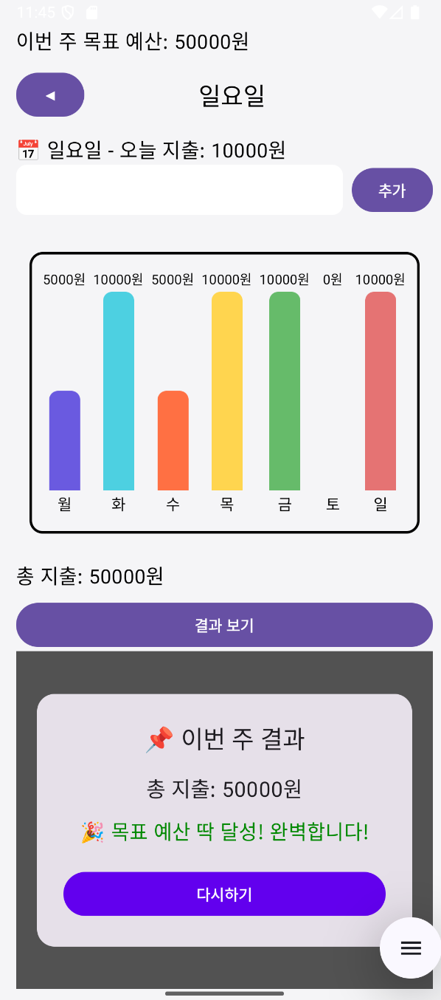
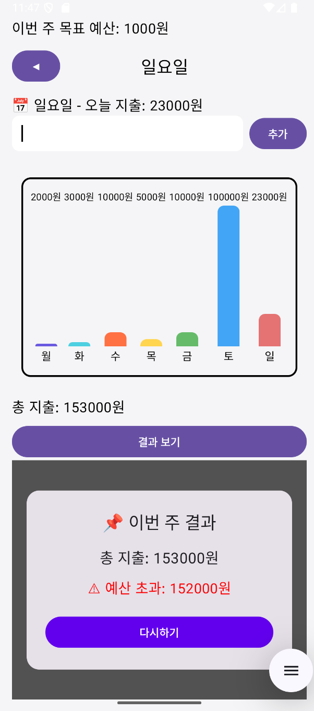
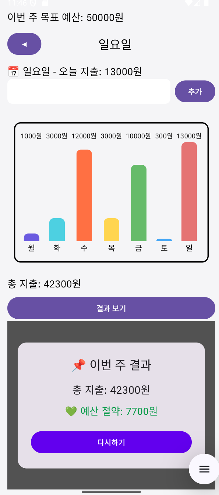

# MobileApp

## 202511003 성연우 의 README

- 주간 지출 프로그램 앱,오픈소스 대회 신청 코드 이름 :Rename

- 앱 개요

주간 지출 프로그램 앱은 일주일 동안의 지출을 기록하고, 목표 예산 대비 지출 현황을
시각적으로 확인할 수 있는 주간 지출 관리 앱입니다.
이 앱은 요일별 지출을 입력하고, 입력된 데이터는 바 그래프로 표시되어 쉽게 비교할 수 있게했습니다.
또한 목표 예산을 설정하면, 일요일 지출을 추가 한 뒤에 총 지출과 예산 대비 결과를 확인할 수 있도록 만들었습니다.

- 개발 과정

UI 설계 및 레이아웃 구성:
Compose를 이용하여 단일 화면 기반 앱 설계했고
Column과 Row, Box를 조합하여 화면 구성했습니다

위쪽에는 목표 예산 입력
중간에는 요일 선택 버튼과 지출 입력
밑쪽에는 지출 바 그래프 및 결과 화면을 넣었고
Spacer를 활용하여 요소 간 간격 조절하였습니다.

Compose의 remember와 mutableStateOf, mutableStateListOf를 활용해 앱 상태를 저장하였고
currentDayIndex 는 현재 선택된 요일 그리고 dailyExpenses 는 요일별 지출 리스트
expenseInput, budgetInput 는 사용자가 입력한 텍스트, weeklyBudget는 설정된 목표 예산을 설정
showResultScreen, showLargeDay 는  앱 실행 화면과 요일을 확대 표시했습니다.

BasicTextField로 사용자 입력을 처리하였고, Button 클릭 시 숫자 여부 검사 
dailyExpenses는 바로 업데이트 할수 있도록 했고
Toast는 메시지로 입력 확인하게 하였습니다

중간에 좌 우에 있는 버튼으로 요일 변경을 가능하게 했고
현재 선택된 요일은 중앙에 표시, 요일 이동하면 지출 입력과 바 그래프가 업데이트되도록 하였습니다
StyledBarGraph 컴포저블 함수는 최대 지출값 기준으로 각 요일의 지출을 비율(heightFraction)로 표시하도록 했고
다 다른 색깔을 사용해 각 요일의 지출을 표시하는 막대를 구분하였습니다
전체 그래프에는 허전하여 테두리(Box + border) 추가하였고
막대 위에 지출 금액 표시 아래에는 요일 표시하였습니다

결과 화면은 일요일 지출이 입력된 경우 showResultScreen 활성화하여
Card로 결과 표시하였고
총 지출, 목표 예산 대비 초과/절약을 확인, 다시하기 버튼으로 다시 주간 지출 프로그램을 할수있도록 만들었습니다

애니메이션 및 메시지 표시는
CoroutineScope와 delay를 활용하여 예산 설정 후 체크 표시 메시지를 표시하도록 했습니다

- 목표 지출을 맞췄을떄

- 목표 지출을 초과했을떄

- 목표 지출보다 절약했을떄

