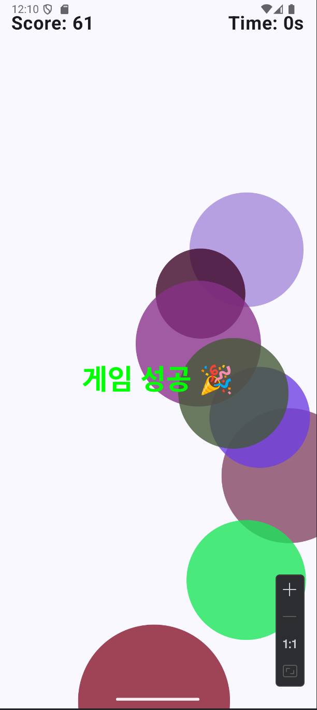

# mobileapp

## 202511003 성연우 의 README

- week3 UI 화면

원래 하였던 실습은 버튼을 눌러도 실행이 되지 않았지만 상태변수(mutableStateOf),(remember)를 사용하여
(도서관 소개),(위치),버튼을 누르면 화면에 텍스트가 나오게 만들었습니다 그리고 (초기화) 버튼을 누르면 화면을
초기상태로 되돌리게 만들었습니다 버튼 배치는 (Row)를 사용하였습니다

- week4 UI 화면

실습때 만들었던 커스텀 디자인 만들기에서 다크 모드를 설정하는것이 있었는데 그것을 참고하여 버튼을 눌러
라이트 모드와 다크모를 마음대로 선택할수 있게 만들었습니다

- week05 UI 화면
실습때 있던 count 는 빼버리고  스톱워치 코드를 활용해서 30초 타이머를 구현했습니다
 제한 시간 동안 버튼을 누를 때마다 점수를 올리는 기능을 추가했습니다.30초 안에 점수를 60점을 넘기면
성공했다는 텍스트와 옆에 얻었던 점수를 나오게 했고 30초안에 점수를 넘기지 못한다면 실패 와 얻었던 점수를
나오게 했습니다 그리고  LaunchedEffect와 delay() 함수를 사용하여 1초 단위로 남은 시간을 갱신했습니다.
리셋을 누르면 다시 처음으로 돌아가게 만들었고 게임을 하는중에도 돌아갈수 있게 만들었습니다

- week6 UI
실습 떄 만들었던 버블게임을 플레이해보니 너무 쉬어보여서 시간을 60초에서 30초로 변경 
gameState.isGameOver 상태를 사용하여 게임 종료시에 텍스트가 뜨게 하였고 30초가 지나면
자동으로 종료 if 함수를 이용하여 30초 안에 60점을 못넘을시 게임실패라는 텍스트가 뜨게 하였고 넘을시에는
  게임 성공이라는 텍스트를 띄우게 변경하였습니다

